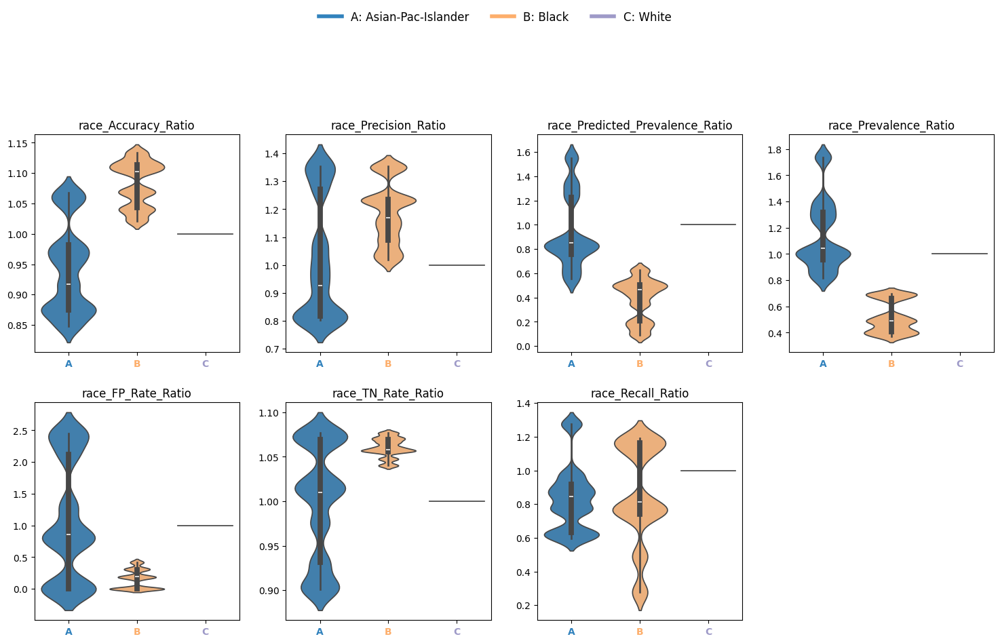
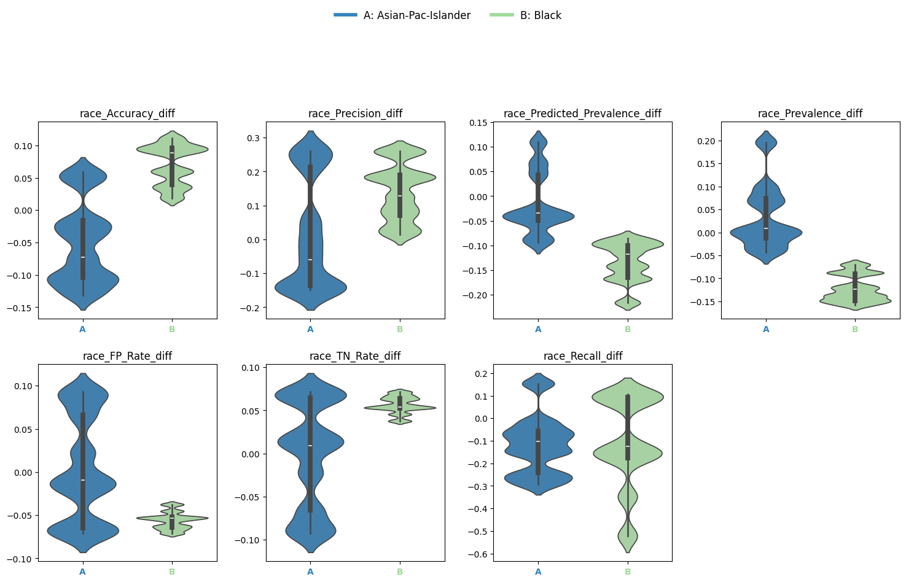
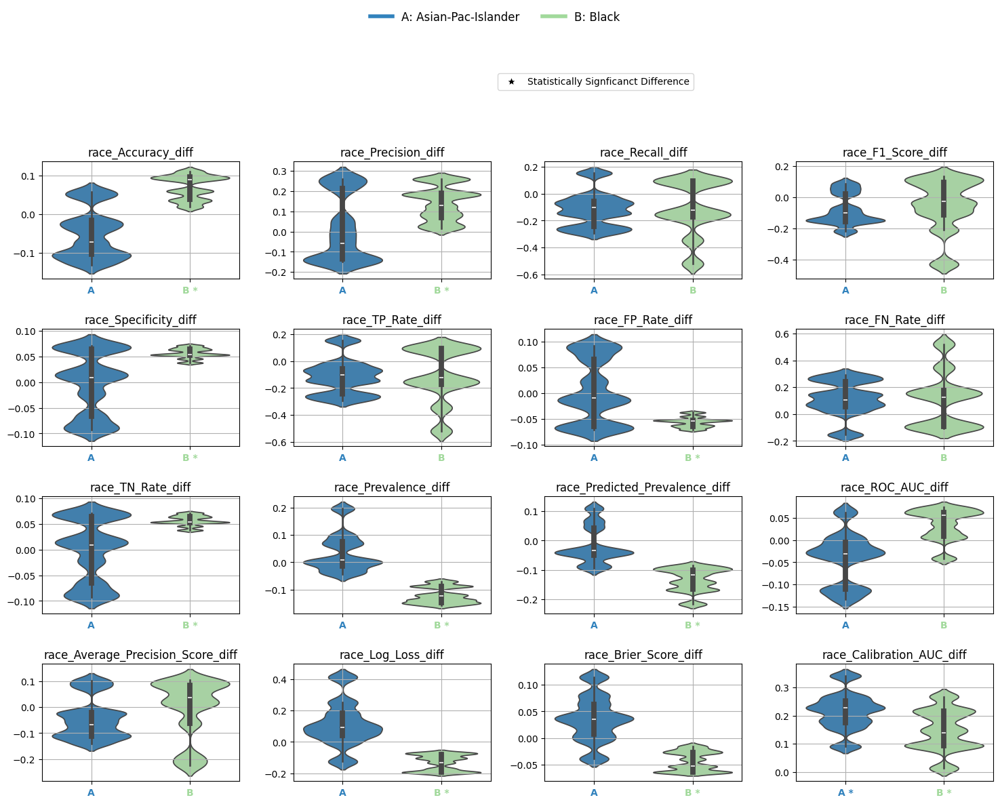

.. _bootstrapped_estimates:

.. raw:: html

   

.. image:: ../assets/EquiBoots.png
   :alt: EquiBoots Logo
   :align: left
   :width: 300px

.. raw:: html
   
   

Bootstrap Estimate Evaluation
==========================================

While point estimates provide a snapshot of model performance for each subgroup, 
they do not capture uncertainty or statistical variability. Bootstrap estimates 
enhance fairness auditing by enabling confidence interval computation, statistical 
significance testing, and disparity analysis through repeated resampling.

EquiBoots supports bootstrap-based estimation for both classification and regression 
tasks. This section walks through the process of generating bootstrapped group metrics, 
computing disparities, and performing statistical tests to assess whether observed 
differences are statistically significant.

1. Bootstrap Setup
------------------------

**Step 1.1: Instantiate EquiBoots with Bootstrapping**
~~~~~~~~~~~~~~~~~~~~~~~~~~~~~~~~~~~~~~~~~~~~~~~~~~~~~~~~~

To begin, we instantiate the ``EquiBoots`` class with the required inputs: the 
true outcome labels (``y_test``), predicted class labels (``y_pred``), 
predicted probabilities (``y_prob``), and a DataFrame that holds sensitive
attributes like ``race`` or ``sex``.

.. note::

    ``y_pred``, ``y_prob``, ``y_test`` are defined inside the :ref:`modeling generation section <Modeling_Generation>`.

.. note::
    For reccomended behaviour over 5000 bootstraps should be used. This ensures that we are properly 
    estimating the normal distribution.

Bootstrapping is enabled by passing the required arguments during initialization. 
You must specify:
- A list of random seeds for reproducibility
- `bootstrap_flag=True` to enable resampling
- The number of bootstrap iterations (`num_bootstraps`)
- The sample size for each bootstrap
- Optional settings for stratification and balancing

.. code:: python

    import numpy as np
    import equiboots as eqb

    int_list = np.linspace(0, 100, num=10, dtype=int).tolist()

    eq2 = eqb.EquiBoots(
        y_true=y_test,
        y_pred=y_pred,
        y_prob=y_prob,
        fairness_df=fairness_df,
        fairness_vars=["race"],
        seeds=int_list,
        reference_groups=["White"],
        task="binary_classification",
        bootstrap_flag=True,
        num_bootstraps=5001,
        boot_sample_size=1000,
        group_min_size=150,
        balanced=False,
        stratify_by_outcome=False,
    )

**Step 1.2: Slice by Group and Compute Metrics**
~~~~~~~~~~~~~~~~~~~~~~~~~~~~~~~~~~~~~~~~~~~~~~~~~~~~

Once initialized, use the `grouper()` and `slicer()` methods to prepare bootstrapped 
samples for each subgroup:

.. code:: python

    eq2.grouper(groupings_vars=["race"])
    boots_race_data = eq2.slicer("race")

Once this is done we get the metrics for each bootstrap, this will return a list of metrics for each bootstrap.
This may take some time to run. 

.. code:: python

    race_metrics = eq2.get_metrics(boots_race_data)

2. Disparity Analysis
------------------------

Disparities quantify how model performance varies across subgroups relative to a reference.
Here we look at the ratio. 

- **Disparity Ratio:** Metric ratio between a group and the reference

.. math::

    \text{Disparity Ratio} = \frac{M(G)}{M(R)} \quad

.. code:: python

    dispa = eq2.calculate_disparities(race_metrics, "race")

**Plot Disparity Ratios**

Use violin plots to visualize variability in disparity metrics across bootstrap iterations:

.. code:: python

    eqb.eq_group_metrics_plot(
        group_metrics=dispa,
        metric_cols=[
            "Accuracy_Ratio", "Precision_Ratio", "Predicted_Prevalence_Ratio",
            "Prevalence_Ratio", "FP_Rate_Ratio", "TN_Rate_Ratio", "Recall_Ratio",
        ],
        name="race",
        categories="all",
        plot_type="violinplot",
        color_by_group=True,
        strict_layout=True,
        figsize=(15, 8),
        leg_cols=7,
        max_cols=4,
    )

**Output**

.. raw:: html 

    

.. raw:: html

    

3. Metric Differences
------------------------
EquiBoots also enables the user to look at the disparity in metric differences. The difference between the performance of the model for one group against the reference group.

- **Disparity Difference:** Metric difference between a group and the reference

.. math::

    \text{Disparity Difference} = M(G) - M(R)

.. code:: python

    diffs = eq2.calculate_differences(race_metrics, "race")

.. code:: python

    eqb.eq_group_metrics_plot(
        group_metrics=diffs,
        metric_cols=[
            "Accuracy_diff", "Precision_diff", "Predicted_Prevalence_diff",
            "Prevalence_diff", "FP_Rate_diff", "TN_Rate_diff", "Recall_diff",
        ],
        name="race",
        categories="all",
        plot_type="violinplot",
        color_by_group=True,
        strict_layout=True,
        figsize=(15, 8),
        leg_cols=7,
        max_cols=4,
    )

**Output**

.. raw:: html

   

.. raw:: html

    

4. Statistical Significance Testing
--------------------------------------

To determine whether disparities are statistically significant, 
EquiBoots provides bootstrap-based hypothesis testing. This involves comparing the 
distribution of bootstrapped metric differences to a null distribution of no effect.

.. code:: python

    metrics_boot = [
        "Accuracy_diff", "Precision_diff", "Recall_diff", "F1_Score_diff",
        "Specificity_diff", "TP_Rate_diff", "FP_Rate_diff", "FN_Rate_diff",
        "TN_Rate_diff", "Prevalence_diff", "Predicted_Prevalence_diff",
        "ROC_AUC_diff", "Average_Precision_Score_diff", "Log_Loss_diff",
        "Brier_Score_diff", "Calibration_AUC_diff"
    ]

    test_config = {
        "test_type": "bootstrap_test",
        "alpha": 0.05,
        "adjust_method": "bonferroni",
        "confidence_level": 0.95,
        "classification_task": "binary_classification",
        "tail_type": "two_tailed",
        "metrics": metrics_boot,
    }

    stat_test_results = eq2.analyze_statistical_significance(
        metric_dict=race_metrics,
        var_name="race",
        test_config=test_config,
        differences=diffs,
    )

**4.1: Metrics Table with Significance Annotations** 
~~~~~~~~~~~~~~~~~~~~~~~~~~~~~~~~~~~~~~~~~~~~~~~~~~~~~~~~~~~

You can summarize bootstrap-based statistical significance using `metrics_table()`:

.. code:: python

    stat_metrics_table_diff = eqb.metrics_table(
        race_metrics,
        statistical_tests=stat_test_results,
        differences=diffs,
        reference_group="White",
    )

.. note::

    - Asterisks (*) indicate significant omnibus test results.
    - Triangles (▲) indicate significant pairwise differences from the reference group.

**Output**

.. raw:: html

    
    
<table class="tg">
    <thead>
        <tr>
            <th>Metric</th>
            <th>Black</th>
            <th>Asian-Pac-Islander</th>
        </tr>
    </thead>
    <tbody>
        <tr><td>Accuracy_diff</td><td>0.070 *</td><td>-0.050</td></tr>
        <tr><td>Precision_diff</td><td>0.141 *</td><td>0.016</td></tr>
        <tr><td>Recall_diff</td><td>-0.111</td><td>-0.119</td></tr>
        <tr><td>F1_Score_diff</td><td>-0.050</td><td>-0.080</td></tr>
        <tr><td>Specificity_diff</td><td>0.056 *</td><td>-0.002</td></tr>
        <tr><td>TP_Rate_diff</td><td>-0.111</td><td>-0.119</td></tr>
        <tr><td>FP_Rate_diff</td><td>-0.056 *</td><td>0.002</td></tr>
        <tr><td>FN_Rate_diff</td><td>0.111</td><td>0.119</td></tr>
        <tr><td>TN_Rate_diff</td><td>0.056 *</td><td>-0.002</td></tr>
        <tr><td>Prevalence_diff</td><td>-0.122 *</td><td>0.035</td></tr>
        <tr><td>Predicted_Prevalence_diff</td><td>-0.133 *</td><td>-0.016</td></tr>
        <tr><td>ROC_AUC_diff</td><td>0.035</td><td>-0.041</td></tr>
        <tr><td>Average_Precision_Score_diff</td><td>-0.005</td><td>-0.044</td></tr>
        <tr><td>Log_Loss_diff</td><td>-0.131 *</td><td>0.113</td></tr>
        <tr><td>Brier_Score_diff</td><td>-0.043 *</td><td>0.036</td></tr>
        <tr><td>Calibration_AUC_diff</td><td>0.148 *</td><td>0.215 *</td></tr>
    </tbody>
    </table>

.. raw:: html

    

**4.2: Visualize Differences with Significance**
~~~~~~~~~~~~~~~~~~~~~~~~~~~~~~~~~~~~~~~~~~~~~~~~

Finally, plot the statistically tested metric differences:

.. code:: python

    eqb.eq_group_metrics_plot(
        group_metrics=diffs,
        metric_cols=metrics_boot,
        name="race",
        categories="all",
        figsize=(20, 10),
        plot_type="violinplot",
        color_by_group=True,
        show_grid=True,
        max_cols=6,
        strict_layout=True,
        show_pass_fail=False,
        statistical_tests=stat_test_results,
    )

**Output**

.. raw:: html

   

.. raw:: html

    

Summary
-------------

Bootstrapping provides a rigorous and interpretable framework for evaluating fairness 
by estimating uncertainty in performance metrics, computing disparities, and identifying 
statistically significant differences between groups.

Use EquiBoots to support robust fairness audits that go beyond simple point comparisons 
and account for sampling variability and multiple comparisons.

