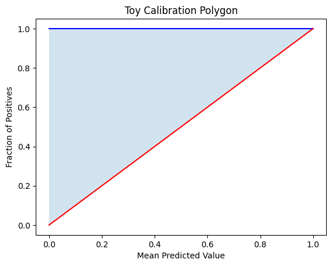
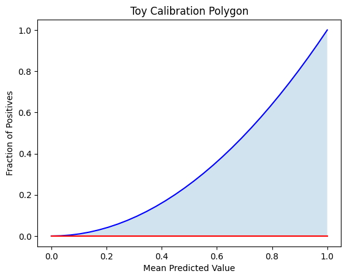

.. _mathematical_framework:

.. raw:: html

   

.. image:: ../assets/EquiBoots.png
   :alt: EquiBoots Logo
   :align: left
   :width: 300px

.. raw:: html
   
   

.. _calibration_auc:

Calibration Curves and Area Under the Curve
=============================================

Understanding the mathematical intuition behind calibration curves and related 
metrics helps clarify their diagnostic value in evaluating model reliability. 
This section outlines foundational concepts using simplified examples, progressing 
toward their real-world interpretation in model evaluation.

Calibration Curves and Area Interpretation
--------------------------------------------

Calibration curves visualize how well predicted probabilities align with actual outcomes. A perfectly calibrated model lies along the diagonal line, where predicted probability equals observed frequency.

Below are two manual examples using toy functions to illustrate the concept of **area under the calibration curve**, a key component of metrics like Calibration AUC.

Example 1: Calibration with y = x²
~~~~~~~~~~~~~~~~~~~~~~~~~~~~~~~~~~~~~~

This function simulates underconfident predictions, where the model consistently underestimates risk.

To compute the calibration area under this curve from \( x = 0 \) to \( x = 1 \):

.. math::

   \text{Area} = \int_0^1 x^2 \, dx

Solution:

.. math::

   \left[ \frac{x^3}{3} \right]_0^1 = \frac{1}{3}

The area under the ideal calibration line (diagonal) is:

.. math::

   \int_0^1 x \, dx = \left[ \frac{x^2}{2} \right]_0^1 = \frac{1}{2}

So, the polygonal calibration AUC becomes:

.. math::

   \frac{1}{2} - \frac{1}{3} = \frac{1}{6}

.. raw:: html

    

Example 2: Calibration with y = x² + 4x
~~~~~~~~~~~~~~~~~~~~~~~~~~~~~~~~~~~~~~~~~~~~

This toy example models overconfident predictions, where the model consistently overshoots risk.

To calculate the area under the curve from \( x = 0 \) to \( x = 1 \), we compute the definite integral:

.. math::

    \text{Area} = \int_0^1 (x^2 + 4x) \, dx

**Solution:**

We split the integral into two separate parts:

.. math::

    \int_0^1 (x^2 + 4x) \, dx = \int_0^1 x^2 \, dx + \int_0^1 4x \, dx

**First Integral:**

.. math::

    \int_0^1 x^2 \, dx = \left[ \frac{x^3}{3} \right]_0^1 = \frac{1^3}{3} - \frac{0^3}{3} = \frac{1}{3}

**Second Integral:**

.. math::

    \int_0^1 4x \, dx = 4 \int_0^1 x \, dx = 4 \left[ \frac{x^2}{2} \right]_0^1 = 4 \left( \frac{1^2}{2} - \frac{0^2}{2} \right) = 4 \cdot \frac{1}{2} = 2

**Final Answer:**

.. math::

    \int_0^1 (x^2 + 4x) \, dx = \frac{1}{3} + 2 = \frac{7}{3}

This result represents the total area under the curve :math:`y = x^2 + 4x` over the interval :math:`[0, 1]`. If comparing against the ideal calibration line :math:`( y = x)`, you would subtract the diagonal area :math:`( \frac{1}{2})` to isolate the calibration polygon AUC.

.. note::
    
    In real calibration plots, the area is bounded within [0,1] on both axes. This example is meant to illustrate the mechanics of integration over a custom curve.

.. raw:: html

    

Regression Residuals
=============================================

.. _regression_residual_math:

.. math::

   \text{residual}_i = y_i - \hat{y}_i

These residuals are used to compute various **point estimate metrics** that summarize model performance on a given dataset. Common examples include:

- **Mean Absolute Error (MAE)**:

  .. math::

     \text{MAE} = \frac{1}{n} \sum_{i=1}^n \left| y_i - \hat{y}_i \right|

- **Mean Squared Error (MSE)**:

  .. math::

     \text{MSE} = \frac{1}{n} \sum_{i=1}^n \left( y_i - \hat{y}_i \right)^2

- **Root Mean Squared Error (RMSE)**:

  .. math::

     \text{RMSE} = \sqrt{\text{MSE}}

These are considered **point estimates** because they provide single-value summaries of the model's residual error without incorporating uncertainty or sampling variability. To assess the stability or confidence of these estimates, techniques such as **bootstrapping** can be used to generate distributions over repeated samples.

Chi-Square Tests and Cochran's Rule
=============================================

The chi-square test of independence relies on a large-sample approximation.
Its sampling distribution approaches the theoretical chi-square distribution
only when expected cell counts are sufficiently large. When expected counts
are small, the approximation breaks down and p-values become unreliable.

Chi-Square Statistic
--------------------

For a contingency table with observed counts :math:`O_{ij}` and expected
counts :math:`E_{ij}`, the chi-square statistic is:

.. math::

   \chi^2 = \sum_{i,j} \frac{(O_{ij} - E_{ij})^2}{E_{ij}}

The expected count under the null hypothesis of independence is computed
from the row and column marginals:

.. math::

   E_{ij} = \frac{R_i \cdot C_j}{N}

where :math:`R_i` is the total of row :math:`i`, :math:`C_j` is the total
of column :math:`j`, and :math:`N` is the grand total.

Cochran's Rule
--------------

Cochran (1954) provides a practical validity criterion: if more than 20% of
expected cell counts fall below 5, the chi-square approximation should not
be trusted. For a contingency table with :math:`K \times J` cells, the rule
is violated when:

.. math::

   \frac{\#\{(i,j) : E_{ij} < 5\}}{K \cdot J} > 0.20

When this happens, alternative tests are recommended:

- For 2 x 2 tables: Fisher's exact test
- For larger tables: Fisher-Freeman-Halton exact test, or a chi-square
  test with a Monte Carlo simulated p-value

Worked Example: Sparse K x 2 Table
~~~~~~~~~~~~~~~~~~~~~~~~~~~~~~~~~~~

Consider a K x 2 contingency table for the Recall metric across three
groups, populated with small counts:

.. math::

   \begin{array}{|c|c|c|}
   \hline
   \text{Group} & \text{TP} & \text{FN} \\
   \hline
   \text{ref}   & 2 & 1 \\
   \text{A}     & 1 & 1 \\
   \text{B}     & 1 & 0 \\
   \hline
   \end{array}

Row totals: :math:`R = (3, 2, 1)`. Column totals: :math:`C = (4, 2)`.
Grand total: :math:`N = 6`.

Compute the expected count for each cell:

.. math::

   E_{\text{ref}, \text{TP}} = \frac{3 \cdot 4}{6} = 2.00

.. math::

   E_{\text{ref}, \text{FN}} = \frac{3 \cdot 2}{6} = 1.00

.. math::

   E_{A, \text{TP}} = \frac{2 \cdot 4}{6} = 1.33

.. math::

   E_{A, \text{FN}} = \frac{2 \cdot 2}{6} = 0.67

.. math::

   E_{B, \text{TP}} = \frac{1 \cdot 4}{6} = 0.67

.. math::

   E_{B, \text{FN}} = \frac{1 \cdot 2}{6} = 0.33

All six expected cells fall below 5, so the violation fraction is:

.. math::

   \frac{6}{6} = 1.00 > 0.20

Cochran's rule is violated. The chi-square approximation is unreliable on
this table, and a more appropriate test should be substituted.

.. note::

   In ``EquiBoots``, this check is built into ``_chi_square_test``. When the
   rule is violated on a 2 x 2 table, the implementation transparently swaps
   in Fisher's exact test. On larger K x 2 tables, a warning is emitted
   recommending Fisher's exact as a follow-up.

Reference
~~~~~~~~~~

Kim HY (2017). Statistical notes for clinical researchers: Chi-squared test
and Fisher's exact test. *Restorative Dentistry & Endodontics*, 42(2),
152-155. https://pmc.ncbi.nlm.nih.gov/articles/PMC5426219/